First, I'd like to thank the hosts for organizing such an engaging competition and congratulate all the winners. Of all the competitions I've taken part in on Kaggle, this is the one I had the most fun with. 

I first spent a few weeks on the competition writing pure heuristic bots, and for a while I thought the top of the leaderboard would end up being either a strong heuristic or a heuristic with an RL fine-tune on top. What changed my mind was inference speed. A strong heuristic needs a lot of physics computation and a number of small optimizations. For example, just to find the most ships a player could land on a given planet by a given turn, I usually needed seconds per turn. So I took a break, and after reading [3-comet's post](https://www.kaggle.com/competitions/orbit-wars/discussion/697725)[^1], a very generous share, I came back and approached the game with RL instead. My guiding philosophy for RL in this competition is to give the model the full context it needs, plus the right architectural inductive bias for efficient training.

**TL;DR.** My final submissions use a transformer with one token per planet (overall ~1.2M parameters), trained separately for the 2p and 4p tracks by self-play PPO with league training on a single GPU, 2p from a random start and 4p from an imitation-learning initialization. The final model is chosen by local evaluation, the average win-rate over all pairs in a pool of candidates. An inference-time strategy adds a small boost on top, and one uses it while the other does not. The agent beat [Isaiah](https://www.kaggle.com/competitions/orbit-wars/discussion/714324)'s agent once during the evaluation phase. Code available at https://github.com/yijieyuan/kaggle-orbitwar.

Let's get into the full solution, which covers game representation & feature engineering / model architecture / game engine and environment / imitation learning / self-play PPO training / local evaluation / inference-time strategy / evaluation phase / compute and cost.

---

## Game representation & feature engineering

The game state is a variable-size set of planets, comets, and in-flight fleets. A transformer handles that shape naturally, since it takes a variable-length set of tokens, and I can make one token per planet and one per fleet.

I ended up deciding that fleets don't get their own tokens: I wanted to keep the token types to a minimum, and the fleet count is unbounded, so my per-turn compute would grow linearly with the number of fleets in play, which can be easily taken advantage of; it also doesn't quite fit with JAX, which needs predefined tensor shapes. So I decided to incorporate each fleet's information into the planet's future state, which keeps the tokens to a bounded set of at most 44 (40 planets + 4 comets).

This works because a fleet only affects its source and target planets, at its launch turn and arrival turn respectively, changing garrison or ownership. So a passive rollout (roll the game forward with no further launches from either side) captures everything: the garrison and ownership it projects for each planet, at each future turn, carry the full information about every in-flight fleet. In the worst case the rollout would need about 140 turns (a one-ship fleet crossing the full diagonal of 100·√2 at its minimum speed of 1/turn), but in practice the vast majority of fleets arrive within 20 to 30 turns.

**Planet token**: the table below covers everything that goes into it, namely some basic planet state and the passive-projection features, plus a few hand-drafted features from the series that I expect would be hard for the NN to learn from the raw projection.

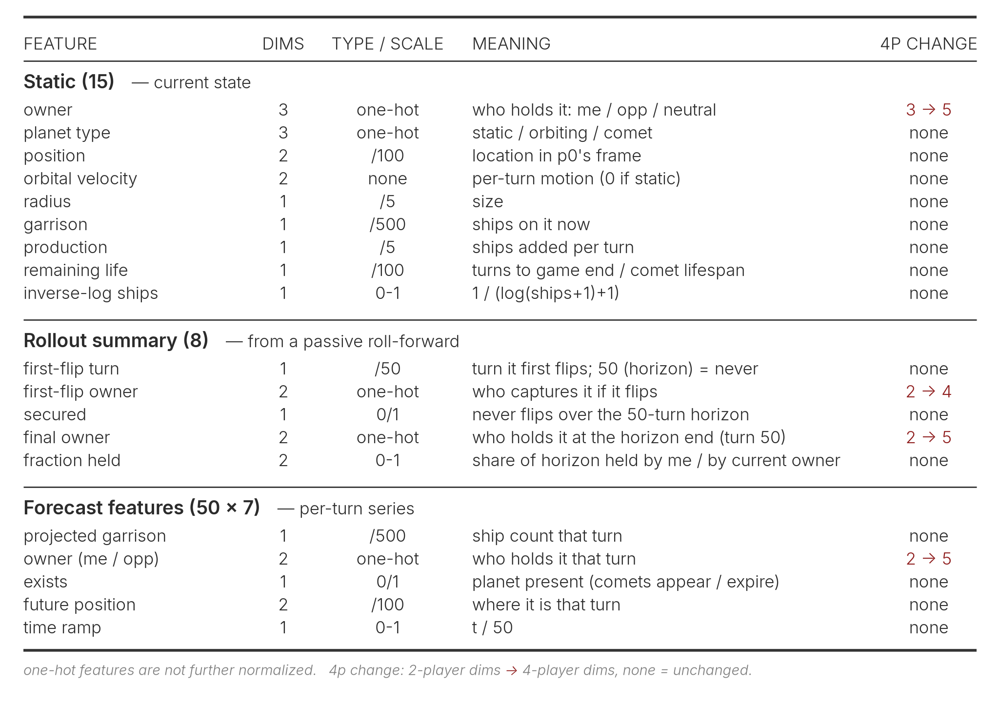

**Global token**: board-level information is injected via a single global token. Like the planet token, it covers some basic board state (turn, planet count, and so on), the ship and production differences at each turn of the passive rollout, plus a few hand-drafted features built on those.

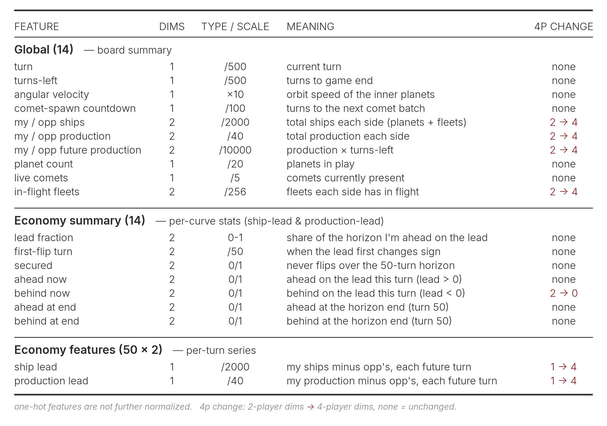

**Pair / edge features**: planet-pair geometry enters as an edge feature $(P \times P \times 6)$, used only as an attention bias inside the transformer and the pointer head rather than as a token. It is seat-independent, so it does not change for 4p.

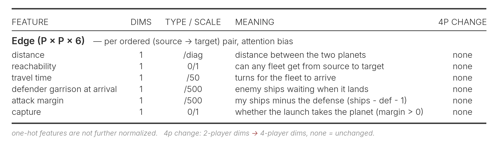

**Design notes & discussion:**

- For some features, the NN could in principle learn them from the raw inputs, so they could be redundant. Adding them costs extra compute each turn and goes against Sutton's Bitter Lesson. When deciding which features to use, I ran several rounds of selection judged on their imitation-learning performance (more in the imitation-learning section), and tried and later dropped a number of ideas along the way, such as planet trajectories. Really telling which features help would need an ablation study over complete runs, but that is tricky because each run is slow to reach a plateau and often needs several restarts that can land at quite different performance.
- Some of the one-hot features could have been a single boolean in 2p, but I kept them one-hot so the same layout extends cleanly to 4p.
- A fleet can hit a passing comet before it reaches its intended target, so a new comet changes the rollout; the forecast features are therefore recomputed whenever one spawns.
- Back when the fraction head was discretized, I tried adding each bin's edge information and its corresponding fleet speed and arrival turn as features, but they had no effect.

That's everything the model gets. Next up is the architecture, which decides how well these features actually work together.

---

## Model architecture

The OrbitNet used in the final submission has roughly 1.2 M parameters, and the same architecture serves both the 2p and 4p agents. MLPs and CNNs perform the token embedding, followed by a multi-head transformer trunk that mixes the tokens, and the result feeds three heads: a pointer head picks the target planet, a fraction head chooses how much of the garrison to send, and a value head scores the position.

**Token embedding**: the static and rollout-summary features and the forecast series are processed separately, then fused into one token. The former are joined into one vector through a small MLP, and the latter is run through a 1-D CNN over its 50 turns then a mean, max, and attention pool (with the attention query from the static features) so the token can focus on the turns that matter. The two embeddings are concatenated, conditioned by [FiLM](https://arxiv.org/abs/1709.07871)[^2] (a zero-initialized projection of the global game-summary vector scales and shifts the fused planet features), and passed through a token MLP into the 128-d planet token, up to 44 of them. The single global token is built the same way, from the game-summary vector and a 1-D CNN embedding of the economy series.

**Main transformer**: the planet tokens and the global token form a length-$(P+1)$ sequence of 128-d tokens, run through a 6-layer pre-LN transformer with 4 heads. On top of ordinary attention, the planet-pair edge features enter as an additive bias: a tiny MLP turns the $(P \times P \times 6)$ pair features into a per-head bias added to the attention scores, so board geometry (who can reach whom, and how far and fast) directly shapes which planets attend to which. The global token sits in the same sequence, so every planet can read the board-level summary through attention.

**Heads**: the transformer's output representations feed three heads.

- **Pointer head.** Every planet produces one logit for each planet on the board through a single attention pass (query·key plus the edge-bias), and a softmax over them picks the target it launches at, with a planet pointing at itself meaning hold, so the launch-or-hold choice sits in the same softmax rather than a separate head. Each of my planets therefore picks its own target in one step, rather than the model first choosing a source planet and then a target, as [Isaiah](https://www.kaggle.com/competitions/orbit-wars/discussion/714324)[^3] and [Billy](https://www.kaggle.com/competitions/orbit-wars/discussion/713483)[^4] do.
- **Fraction head.** This runs after the pointer head so it can see the chosen target. An MLP takes the target's token together with the source and global tokens and regresses the mean and standard deviation of a clipped-Gaussian over the fraction of the garrison to launch. Including the target's token is what lets the launch size adapt to the chosen planet, since a distant or well-defended target needs a different commitment than a weak nearby one.
- **Value head.** It pools the planet tokens and the global token into a single board embedding and predicts the position's value.

**Model parameter and FLOP profile.** The table below breaks down the OrbitNet's roughly 1.2 M parameters and FLOPs by its components. Worth noting is that most of the compute lands on the CNNs that process the per-turn series. Perhaps, as [Billy](https://www.kaggle.com/competitions/orbit-wars/discussion/713483)[^4] does, dropping the CNN and instead flattening the series and concatenating it with everything else for the MLP would have been more reasonable. Shrinking the 50-turn forecast horizon would also help, since most fleets arrive within 20 to 30 turns anyway, and both [Billy](https://www.kaggle.com/competitions/orbit-wars/discussion/713483)[^4] and [Simon](https://www.kaggle.com/competitions/orbit-wars/discussion/713276)[^5] run shorter ones (24 and 20).

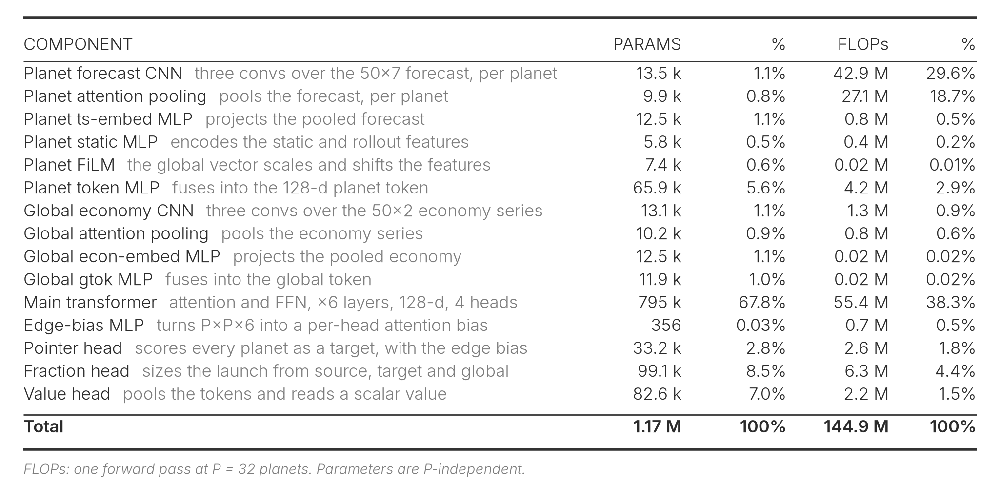

**Design notes & discussion:**

- **Continuous vs discretized.** I started with a discretized fraction head (4, 8, or 16 bins) and switched to the continuous clipped-Gaussian for two reasons. First, once a game was clearly won, the discrete head kept sending small fleets. That is probably harmless, since the game is already decided, but it looks bad to watch, and the continuous head stopped it. Second, for imitation learning, opponents launch with all sorts of fractions, and snapping each one to the nearest bin throws information away, whereas a continuous target keeps it. I have to admit that predicting both $\mu$ and $\sigma$ and sampling during training (argmax at inference) might be a bad idea: $\sigma$ never really shrinks (its mean settles around 0.88 in the $[0,1]$ fraction space), so just predicting $\mu$ would probably have been cleaner, as [Isaiah](https://www.kaggle.com/competitions/orbit-wars/discussion/714324)[^3] did.
- **One action per planet per turn.** My model design means each planet decides a single action per turn, and I did not make the policy autoregressive over several launches. Rolling out $N$ sequential actions would multiply the per-turn inference cost by roughly $N$, and under the 1 s/turn budget that cost outweighs the extra expressiveness it would buy, so I left it out.
- **Cross-planet coordination.** I strongly believe the agent would fight better if planets coordinated, concentrating an attack or a defense once they knew each other's targets. The clean way to get that is an autoregressive policy, but for the inference-cost reason above I ruled it out. So I tried cheaper substitutes in the fraction head instead: pooling the embeddings of the other sources aimed at the same target and feeding that in, and separately giving the head its own cross-planet attention with the edge features. Neither beat the plain MLP, so the final head stays simple.

---

## Game engine and environment

Before getting into the training of the model (imitation learning and self-play RL), a few setup details worth noting.

**The engines.** I keep several engine implementations in lockstep: the official Kaggle engine, a JAX version for fast self-play training, a cross-architecture JAX version that records replays for local evaluation across 2p and 4p and pits different training updates' weights against each other, and a numpy version for deployment. Each is parity-checked against the official engine on a full game, matched step by step at every intermediate state. The boards are all pre-generated, about 131,000 for 2p and 1,024 for 4p, and evaluation always runs on fresh boards the model has never trained on.

**A per-player fleet cap in training.** The real Kaggle engine puts no limit on how many fleets a player can have in flight. My training environment does: each player is capped at 128 active fleets, independently of the others (256 total in 2p, 512 in 4p), and once a player is at the cap its further launches that turn are dropped. This started as a way to keep the JAX environment on fixed-shape arrays, but it also nudges the model to be cautious and save its launches for the ones that matter. In practice the cap only binds early in training, and afterwards the model stays well clear of it. Since the deploy engine is uncapped, I re-apply the same cap in the numpy inference code so the shipped agent behaves exactly as it did in training.

**One viewpoint for all seats.** All coordinates and features are transformed into the standard p0 viewpoint for inference, so every seat, no matter where the player sits, shares one set of weights.

**Design notes & discussion:**

- **One pass, not one per player.** According to [Isaiah's write-up](https://www.kaggle.com/competitions/orbit-wars/discussion/714324)[^3], the per-seat transformation I use is unnecessary and inefficient: because each seat is canonicalized to its own p0 view, I run the network once per player every turn (two passes in 2p, four in 4p) instead of once for the whole board. A single pass can instead produce every source-to-target action, which you then filter by ownership, cutting the rollout forward pass by two to four times.
- **A resign mechanism I tried and dropped.** To stop the model from spamming pointless small fleets in the endgame, I tried adding a resign mechanism: a game ends once one side has held over 75% of the ships for 20 straight turns. It can also improve training efficiency. However, it turns out the models would sometimes collapse in a game they had all but won, so I dropped it.
- **A first-turn off-by-one.** My training env starts from the step-1 observation (turn 1), while deploy sees the first turn as 0, so only the first turn's turn-based features (turn counter, turns-left, comet countdown) come out one off. I patched it by clamping the deploy feature step to at least 1. Tiny impact anyway.
- **Don't train and evaluate on the same boards.** Early on I trained and evaluated on the same 1,024 boards, so models overfit them and looked strong in evaluation. Switching to fresh unseen boards changed the picture completely.

---

## Imitation learning

I mostly used imitation learning as a fast way to validate models and features, since cloning good play is far cheaper to iterate on than a full RL run. With the competition nearly over, I also wanted to see whether it could hand self-play a better set of initial weights, though it turned out that starting from self-play alone probably reaches a higher ceiling.

**Data curation.** I only collect official replays from after the last engine update on 2026-05-27, so every game runs the same current physics, and I keep the ones where both seats are rated above 1500 Elo, weighting the winner's moves above the loser's. This leaves about 21,000 games, roughly 10 million board states. I found that filtering to these stronger matches produced better models even though it left far fewer games to train on, which lines up with [Slawek](https://www.kaggle.com/competitions/orbit-wars/discussion/713187)[^6], who trained only on the top two players' matches each day.

**Training.** The pointer head is a softmax over target planets, trained by cross-entropy against the planet the expert actually launched at (a planet pointing at itself is a hold), with launch rows up-weighted 6x to counter their low base rate:

$$
L_\text{ptr} = -\sum_i w_i \, \log p_\theta(t_i), \qquad w_i = 6 \text{ for a launch, else } 1.
$$

The fraction head predicts the mean and standard deviation $(\mu_i, \sigma_i)$ of a Gaussian clipped to $[0,1]$, fit to the fraction the expert sent, $f_i = \text{ships}/\text{garrison}$, by a negative log-likelihood over the launches only:

$$
L_\text{frac} = -\sum_{i \,\in\, \text{launches}} \log \mathcal{N}_{[0,1]}(f_i \mid \mu_i, \sigma_i).
$$

The total objective is $L = L_\text{ptr} + \tfrac{1}{2} L_\text{frac}$. The value head stays untrained here and is only picked up in self-play. Training runs about 5 epochs (roughly 50,000 updates) with AdamW at a 3e-4 learning rate on a warmup-cosine schedule and batch 1024.

**Evaluation.** I evaluate the imitation performance by playing against the public heuristic agents, [Orbit-Lite](https://www.kaggle.com/code/yijiey/orbit-lite-greedy-planner-regroup-submission)[^7], [Roman](https://www.kaggle.com/code/romantamrazov/orbit-star-wars-lb-max-1224)[^8], and [Shummingfang](https://www.kaggle.com/code/shummingfang/orbit-wars-exp48)[^9]. The table below reports it at the best checkpoint: the 2p head-to-head win-rate against each, and for the four-player games, each player's chance of finishing first together with the probability our model ranks above each opponent.

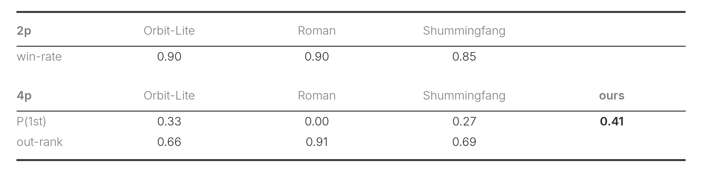

---

## Self-play PPO training

Drawing on previous agent competitions like [Lux AI Season 3](https://kaggle.com/competitions/lux-ai-season-3)[^11], the choice on the RL side was self-play PPO versus IMPALA. IMPALA is a distributed actor-learner architecture, built to parallelize experience collection across many actors that feed a central learner, and I would rather see how far a single GPU can take me than spend my effort on that. I went with PPO and kept it basic, with a self-play league.

**Reward.** The reward is as simple as it gets: +1 for the winner (first place in 4p) and -1 for everyone else.

**Hyperparameters.** Standard PPO with $\gamma = 0.999$, $\lambda = 0.95$, a clip of 0.2, and a value-loss weight of 0.5. The learning rate peaks at 1e-4 and cosine-anneals to 3e-5 over 100k updates, where one update is a single rollout's worth of data used for one epoch of training. That rollout is $T = 128$ steps from 1024 parallel games in 2p (512 in 4p), split into 64 minibatches of about 3,700 samples, with the gradient norm clipped to 1.0. The entropy bonus is 0.01 in 2p and 0.02 in 4p.

**League.** I run a league to keep the opponents diverse and to avoid catastrophic forgetting. Concretely, in 2p, 80% of the games are pure self-play and in the other 20% the learner plays a frozen past checkpoint from a pool. Members are sampled with probability proportional to $1 - \text{winrate}$ (a linear [PFSP weight](https://www.nature.com/articles/s41586-019-1724-z)[^10]), plus a 2% floor. Admission draws only from the periodic checkpoint saves (every 200 updates, and never before update 1000), not from every update: a checkpoint joins the pool once the learner's EMA win-rate against the current reference reaches 70% over at least 1024 games (or after 5000 updates, if it plateaus). The pool holds up to 30 members, evicting the oldest. The 4p league is the same idea adapted to four players: the anchor seat is always the current policy, while each of the other three seats is independently the current policy or a pool member on the same 80/20 split. With no head-to-head win-rate to go on, both the PFSP sampling and the admission gate switch to first-place rate, and a snapshot is admitted once that rate clears 0.35 over 512 games.

**Warm-start vs. random-start.** My submitted 2p agent trains from a random start, not from the imitation model. A random start is weaker at first and trails the warm-started run early on, but somewhere in the 10k to 20k update window it catches up and then pulls ahead, and in the end it is the random-start run that tops the 2p standings in the local-evaluation section. This is like [AlphaGo Zero](https://www.nature.com/articles/nature24270)[^12], which also gave up its earlier warm-start. The submitted 4p agent is warm-started from the imitation checkpoint. Because its performance was still climbing and only a few days were left, I stuck with it and didn't go back to try a random start.

**Experiment notes & discussion:**

- **An observation from hyperparameter tuning.** My first 4p run, at lr 3e-4 with an entropy bonus of 0.05, collapsed after a few hundred updates: the planets stopped launching any fleets at all. Lowering the learning rate to 1e-4 and the entropy bonus to 0.02 fixed it, and it never came back.
- **Breaking moments.** I did see the model pick up behaviors on its own. For example, when a planet of mine can't be defended, it sends the ships out before the enemy arrives and grabs a weaker planet elsewhere instead, for a net gain.
- **...but obvious mistakes remain.** Even in the submitted version I still catch clear errors. Right at the start of a game a valuable +5-production planet sits next door defended by only 20 ships, and instead of taking it while it is cheap the model hoards its fleet and doesn't launch until it has 40 or 50, far later than it should.

---

## Local evaluation

The gold-standard evaluation is the leaderboard. Submit an agent, let it play everyone else's for a day or two, and read off the rank range it settles into. But that is slow, and only two agents can be up at once, so almost every decision is made locally instead.

Early on, while I was debugging and building out the model and the training framework, the public heuristics were my benchmark. Afterwards, I keep a pool of agents (training checkpoints and a few frozen past champions), have every possible 2p and 4p pair play each other repeatedly on a separate GPU through the cross-architecture JAX engine, and score each by its win-rate averaged across pairings.

Taking 2p as the example, the daemon runs in rounds, each following the same fixed order.

**Admit.** A periodic rescan picks up new checkpoints and holds them in a queue, and at the start of a round the whole waiting batch joins the pool.

**Play.** Every pair plays up to a cap of 512 games (256 in 4p). A pool of about 36 checkpoints makes 630 pairs, 35 per checkpoint, and each agent's score is its win-rate averaged equally over its pairs, roughly 480k games in 2p and 215k in 4p across the run. Seats are randomized each game.

**Prune.** When every pair has reached the cap the round is complete, and the pool is trimmed by dropping the lowest-scoring members, active checkpoints down to 30 (10 in 4p) in total but never below 3 per experiment, and each frozen reference down to its best 3. Evicted checkpoints are remembered so they never re-enter.

**Repeat.** The next queued batch is admitted and the loop goes again.

In 2p, the top two checkpoints were u55000 and u53000. In 4p, the top checkpoint u44000 was paired with u39000. Both were combined with the merge detailed in the inference-time strategy section. The two tables below give the standings behind this. Based on this, the training had not plateaued yet, with the overall win-rate still rising about 5% per 10,000 updates.

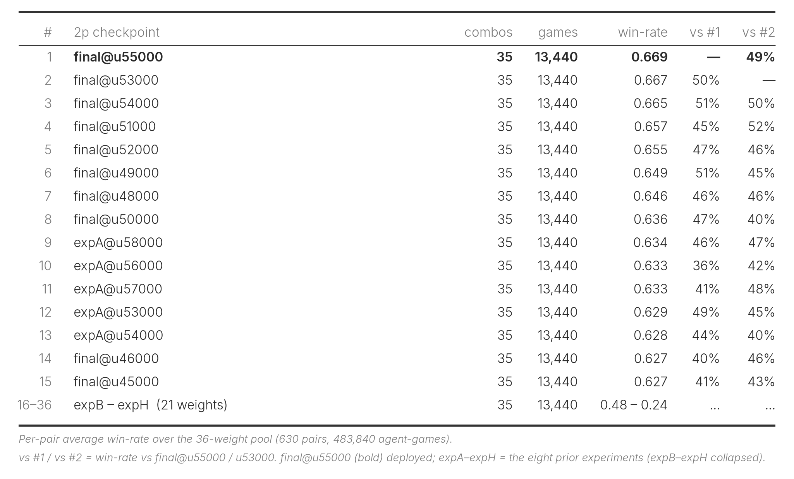

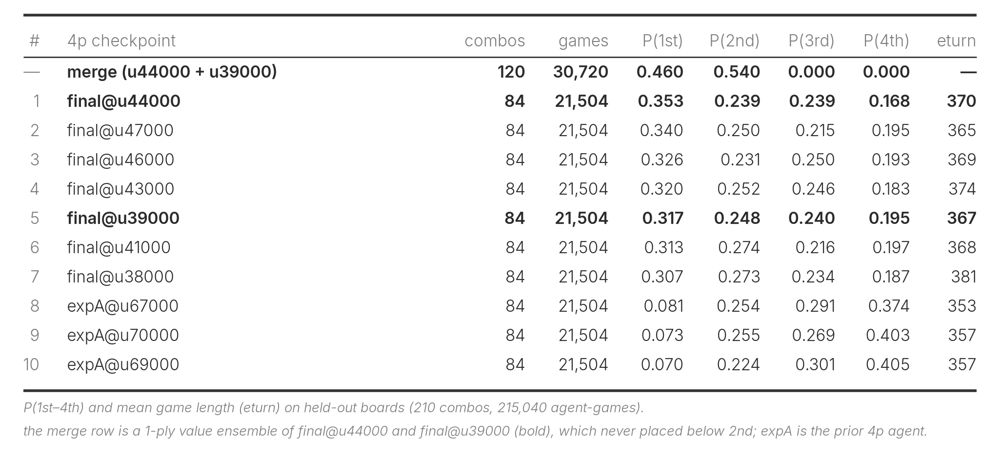

---

## Inference-time strategy

In local evaluation, a single turn takes only about 20 ms, so I wanted to try whether the spare time could go toward some inference-time improvement.

**Mechanism.** Each turn, both checkpoints propose an action. Where they disagree, the engine plays each candidate forward two or three turns against the other checkpoint and keeps whichever the averaged value heads rate higher. 4p is the same, against three copies of the other. I trust the value head as referee for two reasons: its value explained variance held above 0.95 during training, and it tends to call a swing in win probability before any gap opens in the ship or production counts, as the replay at the top shows, so it reads the position earlier than the raw economy does.

In local evaluation this only helped once the rollout was at least two turns deep. The table below runs at depth 3 in 2p and depth 2 in 4p, where the merge beats greedy on both tracks.

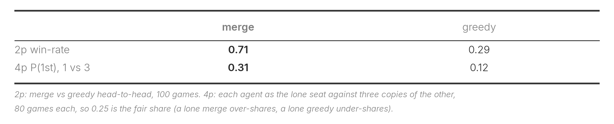

**The two submissions.** I made two submissions, one with the inference-time strategy (merge, `53993338`) and one without (greedy, `53993524`, just the plain argmax decode), as an ablation to check that the merge's local edge survives the leaderboard's more diverse opponents, though I had a feeling the merge would come out ahead.

**Handling the time budget.** Running depth 3 every turn would blow the time budget, so the depth follows the 60-second overage bank instead, running at depth 3 while more than 20 seconds remain, depth 2 while more than 10 remain, and plain greedy below that. 4p uses a single stage, running depth 2 while more than 20 seconds remain and plain greedy below that.

---

## Evaluation Phase

For the two weeks after the first phase closed, all agents were fixed, and I kept tracking the game episodes and the leaderboard. The analysis of that run is below.

The first table pits each of my submissions against each top-20 submission, with the top-20 fixed from a leaderboard snapshot after the first day of evaluation. 2p is the head-to-head win-rate; for 4p I record the win-rate for me and for the opponent over the games where we both play.

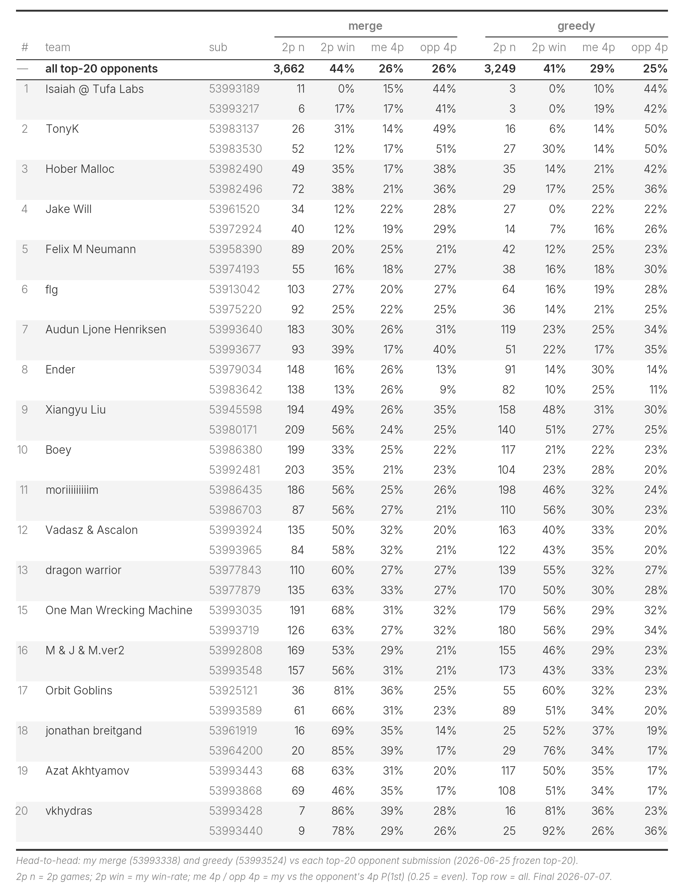

The second table gives the overall win-rate for each submission across the whole evaluation phase.

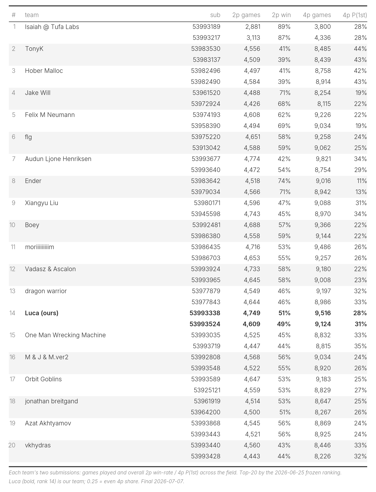

The figure below traces my overall rank and each submission's rank over the evaluation phase.

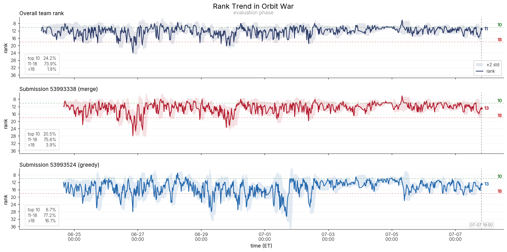

The results seem to show the inference-time strategy (the merge) holds more of an edge in 2p, while the plain greedy does better in 4p, possibly because the 4p merge folds in a checkpoint that is a little too early.

The rank trend seems to change once midway, probably pairing nearby agents against each other more often, after which both submissions grew steadier, with the merge clearly the more stable of the two. So far across the evaluation phase my rank has reached as high as 6th and, in the early days, as low as 28th.

The evaluation was somewhat controversial in the community, mainly because the rank never really converges, so the last few dozen games swing the final standing a lot. Refer to [CPMP's post](https://www.kaggle.com/competitions/orbit-wars/discussion/714395)[^13] and [Ascalon's post](https://www.kaggle.com/competitions/orbit-wars/discussion/716725)[^14].

---

## Compute and cost

Most of the experimentation ran on my local 2× A6000. The two final models were each trained on a rented B200, one for 2p and one for 4p. The 2p run took about 100 hours and the 4p about 98 hours, roughly $630 in total. End to end (game simulation plus the PPO update), the 2p run reached about 36,000 samples per second (SPS) and the 4p run about 28,000, with each player's move in a turn counted as a separate sample, for roughly 13 billion and 9.8 billion samples in total. I only turned to the B200 because I was running out of time in the last few days, and the models still had not plateaued at the submission deadline. The lesson for next time is to settle the framework earlier and leave more time for training and fine-tuning.

---

## Results

Final Elo: 1640.0 (greedy) and 1620.0 (merge), rank 13, swinging between 6th and 28th over the evaluation phase

---

## Closing thoughts

RL leaves very little room for parameter sweeps, because each run takes so long that you cannot afford many hyperparameter searches or full ablations, so I stopped agonizing over the ones I skipped. Intuition ends up mattering more here than in most supervised settings.

Scaling is an art, both in RL and in this game. I tried a 4M-parameter model and it performed much worse than my final one at around 1.2M, so it was great to see how [Isaiah](https://www.kaggle.com/competitions/orbit-wars/discussion/714324)[^3] made scaling work.

Replays are fun to watch, but beyond that, they build real intuition for what the model and its features are doing. They help tell apart the failure modes, whether the features do not carry enough information, the architecture is the bottleneck, or even a training hyperparameter is off. For example, setting gamma to 1 made the model happy to drag games out to the 500-turn limit.

To make this game more fun, it could use a few physics-bending abilities, say a skill that speeds every planet up for the next 10 turns, or a comet you can drop on a path you choose.

Code available at https://github.com/yijieyuan/kaggle-orbitwar.

[^1]: Lin Myat Ko (3-comet). ["Sharing our RL lessons so far"](https://www.kaggle.com/competitions/orbit-wars/discussion/697725). Kaggle Orbit Wars discussion.
[^2]: Ethan Perez, Florian Strub, Harm de Vries, Vincent Dumoulin, Aaron Courville. ["FiLM: Visual Reasoning with a General Conditioning Layer"](https://arxiv.org/abs/1709.07871). AAAI 2018.
[^3]: Isaiah Pressman. ["Scaling Reinforcement Learning to the Stars"](https://www.kaggle.com/competitions/orbit-wars/discussion/714324). Kaggle Orbit Wars discussion.
[^4]: Billy Bradley. ["How I made Ender"](https://www.kaggle.com/competitions/orbit-wars/discussion/713483). Kaggle Orbit Wars discussion.
[^5]: Simon Jégou. ["N < 10th Solution for Orbit Wars"](https://www.kaggle.com/competitions/orbit-wars/discussion/713276). Kaggle Orbit Wars discussion.
[^6]: Slawek Biel. ["Last day scramble"](https://www.kaggle.com/competitions/orbit-wars/discussion/713187). Kaggle Orbit Wars discussion.
[^7]: Slawek Biel. "Orbit-Lite: Greedy Planner & Regroup". [Kaggle notebook](https://www.kaggle.com/code/yijiey/orbit-lite-greedy-planner-regroup-submission).
[^8]: Roman Tamrazov. ["orbit-star-wars lb-max-1224"](https://www.kaggle.com/code/romantamrazov/orbit-star-wars-lb-max-1224). Kaggle notebook.
[^9]: shummingfang. ["orbit-wars-exp48"](https://www.kaggle.com/code/shummingfang/orbit-wars-exp48). Kaggle notebook.
[^10]: Oriol Vinyals et al. ["Grandmaster level in StarCraft II using multi-agent reinforcement learning"](https://www.nature.com/articles/s41586-019-1724-z). Nature 2019.
[^11]: Stone Tao, Akarsh Kumar, Bovard Doerschuk-Tiberi, Isabelle Pan, Addison Howard, and Hao Su. ["Lux AI Season 3"](https://kaggle.com/competitions/lux-ai-season-3). NeurIPS 2024, Kaggle.
[^12]: David Silver et al. ["Mastering the game of Go without human knowledge"](https://www.nature.com/articles/nature24270). Nature 2017.
[^13]: CPMP. ["Will the LB stabilize?"](https://www.kaggle.com/competitions/orbit-wars/discussion/714395). Kaggle Orbit Wars discussion.
[^14]: Ascalon. ["Proposal to improve ranking convergence"](https://www.kaggle.com/competitions/orbit-wars/discussion/716725). Kaggle Orbit Wars discussion.
